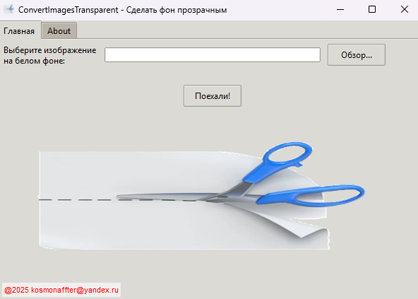

ConvertImagesTransparent

Приложение для автоматического удаления белого фона с изображений и создания прозрачного PNG.


✨ Возможности
Удаление белого фона - автоматическое определение и удаление белого фона

Поддержка форматов - работа с PNG, JPG, BMP, ICO

Простой интерфейс - интуитивно понятное графическое окно

Пакетная обработка - возможность обработки нескольких изображений

Качество сохранения - сохранение в формате PNG с прозрачностью

🚀 Быстрый старт
Скачать готовую версию
Скачайте файл ConvertImages_T.exe из папки dist/

Запустите исполняемый файл

Выберите изображение и нажмите "Поехали!"

Установка из исходного кода
Клонируйте репозиторий:

bash
git https://github.com/Kosmonaffter/Transparent_background.git
cd Transparent_background
Установите зависимости:

bash
pip install -r requirements.txt
Запустите приложение:

bash
python start.py
🛠️ Сборка исполняемого файла
Для создания standalone версии:

bash
pyinstaller --onefile --windowed --icon=icon/Icon_apps_T.ico --name ConvertImages_T start.py
Или используйте готовый скрипт:

bash
python build.py
## 📁 Структура проекта
``` python
Transparent_background/
├── dist/ # Готовые исполняемые файлы
│ └── ConvertImages_T.exe
├── icon/ # Иконки приложения
│ └── Icon_apps_T.ico
├── images/ # Демо-изображения
│ ├── image_1.png
│ └── image_2.png
├── start.py # Основной файл приложения
├── backend.py # Логика обработки изображений
├── requirements.txt # Зависимости проекта
└── README.md # Документация
```
🎯 Как использовать
Запустите приложение - откройте ConvertImages_T.exe

Выберите изображение - нажмите "Обзор..." и выберите файл

Обработайте - нажмите "Поехали!"

Получите результат - файл сохранится с суффиксом _transparent.png

🔧 Технические детали
Поддерживаемые форматы:
Входные: PNG, JPG, BMP, ICO

Выходные: PNG с прозрачностью

Алгоритм работы:
Конвертация изображения в RGBA

Поиск пикселей белого цвета (255, 255, 255)

Замена белого фона на прозрачный

Сохранение в формате PNG

Зависимости:
Pillow - работа с изображениями

tkinter - графический интерфейс

pyinstaller - сборка исполняемых файлов

🐛 Решение проблем
Приложение не запускается
Убедитесь, что установлен .NET Framework

Проверьте антивирус (может блокировать .exe файлы)

Изображение не обрабатывается
Проверьте формат файла (поддерживаются PNG, JPG, BMP, ICO)

Убедитесь, что фон действительно белый

Нужно изменить цвет фона
Отредактируйте параметр color_to_transparent в файле backend.py:

python
# Для черного фона:
color_to_transparent = (0, 0, 0)

# Для синего фона:
color_to_transparent = (0, 0, 255)

# 📞 Поддержка
Автор: Юрий Атласюк

Telegram: @kosmonafftsb

Email: kosmonaffter@yandex.ru

Год: 2025